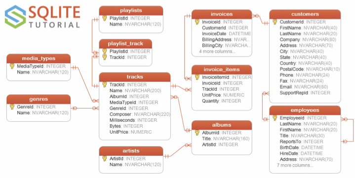

## Seminar 01 - Introduction to databases

In this first seminar, we will cover some introductory concepts related to database modelling and programming.

### Activity 1: data modelling

Have a look at this Jamboard with a data modelling exercise on a standard clinical setting (patient - GP - consultation).

[Data modelling exercise](https://jamboard.google.com/d/1SPE9MUNdNup1X7FY14PYLnqC1A-uuJJ4BIiii40wCvM/edit?usp=sharing) - Jamboard

### Activity 2.1: data modelling

Have a look at this fictional online music shop (*sample database*) named **Chinook** in SQLite.



There are 11 tables in the *Chinook* sample database:

* ``employees:`` stores employees data such as employee id, last name, first name, etc. It also has a field named *Reports_To* to specify who reports to whom.
* ``customers:`` stores customers data.
* ``invoices & invoice_items:`` these two tables store invoice data. The ``invoices`` table stores invoice header data and the ``invoice_items`` table stores the invoice line items data.
* ``artists:`` stores artists data. It is a simple table that contains only the artist id and name.
* ``albums:`` stores data about a list of tracks. Each album belongs to one artist. However, one artist may have multiple albums.
* ``media_types:`` stores media types such as MPEG audio and AAC audio files.
* ``genres:`` stores music types such as rock, jazz, metal, etc.
* ``tracks:`` stores the data of songs. Each track belongs to one album.
* ``playlists & playlist_track:`` ``playlists`` table store data about playlists. Each playlist contains a list of tracks. Each track may belong to multiple playlists. The relationship between the playlists table and tracks table is many-to-many. The ``playlist_track`` table is used to reflect this relationship.

Based on the figure and this brief description of each table (notice we don't have metadata information), answer the following questions:

1. Do you agree with the modelling and existing relationships among ``albums, artists, tracks, playlists, genres,`` and ``media_types``? Can you spot any missing attribute in those entities?
2. Can you explain why the attribute *Bytes* is included in the ``tracks`` table?
3. Do you realise that the table ``playlist_track`` is used to capture a M:N relationship between ``playlists`` and ``tracks`` (one playlist has several tracks and one track can pertain to several playlists)? Do you imagine a different way of modelling and/or implementing this relationship?
4. Looking at ``invoice_items``, do you spot any inconsistency (missing or unnecessary attribute)?
5. Can you explain/imagine the relationship between ``employees`` and ``customers``? What practical implications this relationship brings when registering a new customer or removing an existing employee?

**Submit your answer through [Gradescope, Week_01_2_1: Data modelling Chinook](https://www.gradescope.com/courses/278944/assignments/1377314/submissions)**

### Activity 2.2: SQL programming

You can [download the sample database here](https://www.sqlitetutorial.net/wp-content/uploads/2018/03/chinook.zip) if you want to *do this activity in your local computer using the SQLIte shell* **OR** you can use [this Web interface](https://www.sqlitetutorial.net/tryit/) for accessing the SQLite's sample database.

Write SQL commands for the following questions:

1. Print all track names in the playlist "Heavy Metal Classic". Additionally, you can test with other playlists (e.g. Grunge, Brazilian Music).

<details><summary><b>Solution (Click me)</b></summary>
 
```sql
  SELECT T.Name as TrackName
    FROM tracks T, playlist_track PT 
   WHERE T.TrackId = PT.TrackId and PT.PlaylistId IN 
         (SELECT PlaylistID
            FROM playlists
           WHERE Name = "Heavy Metal Classic");
```
  
</details>

2. Find the invoice with the highest total value and print its invoice items.

<details><summary><b>Solution (Click me)</b></summary>
 
```sql
 SELECT * 
   FROM invoice_items 
  WHERE InvoiceID IN 
        (SELECT InvoiceId FROM invoices WHERE Total IN 
        (SELECT MAX(Total) FROM invoices));
```
  
</details>

3. Find the three customers who bought most items and print their details.

<details><summary><b>Solution (Click me)</b></summary>
 
```sql
 SELECT * 
   FROM customers 
  WHERE customerid IN 
        (SELECT customerid FROM invoices where total IN
        (SELECT Total FROM invoices ORDER BY Total DESC) LIMIT 3);
```
  
</details>

4. Which tracks are by Amy Winehouse?

<details><summary><b>Solution (Click me)</b></summary>
 
```sql
 SELECT Name, Title
   FROM Artists
   JOIN Albums ON Albums.ArtistId = Artists.ArtistId
  WHERE Name = "Amy Winehouse";
```
 
</details>

**Submit your answer through [Gradescope, Week_01_2_2: SQL programming Chinook](https://www.gradescope.com/courses/278944/assignments/1377323/submissions)**

### Homework

Have a look at the following examples on how to use SQLite inside Python. These are toy examples but useful for a first view on libraries we need to import, how we can connect with a database and issue SQL commands to create tables, insert and query data on them.

A) Example 1: [sqlite3_aquarium.ipynb](./sqlite3_aquarium.ipynb) - You can open this file using Google Colab or your local Jupyter notebook (Anaconda). Alternatively, you can run this [sqlite_aquarium.py](./sqlite_aquarium.py) on your terminal (shell).

B) Example 2: [Ex_PythonSQL_2.ipynb](./Ex_PythonSQL_2.ipynb) - You can open this file using Google Colab or your local Jupyter notebook (Anaconda). Please, observe that you also need the [db_utils.py](./db_utils.py) file implementing some helper functions for connecting to a database and creating tables. Alternatively, you can run this [Ex_PythonSQL_2.py](./Ex_PythonSQL_2.py) on your terminal (shell).

### References

[SQL Tutorial](https://www.sqlitetutorial.net/)
