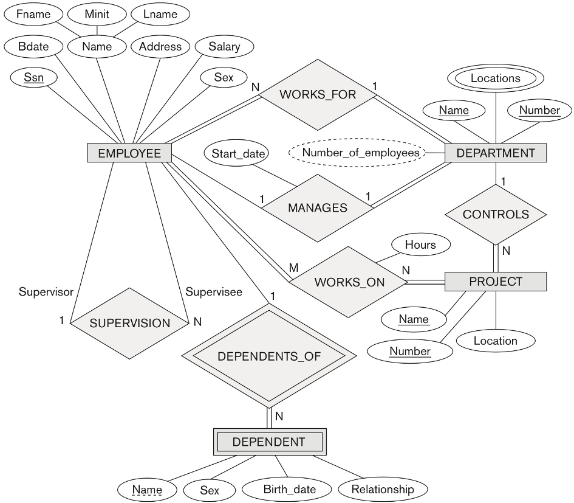
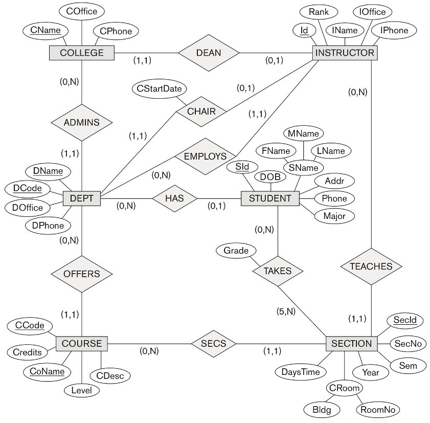
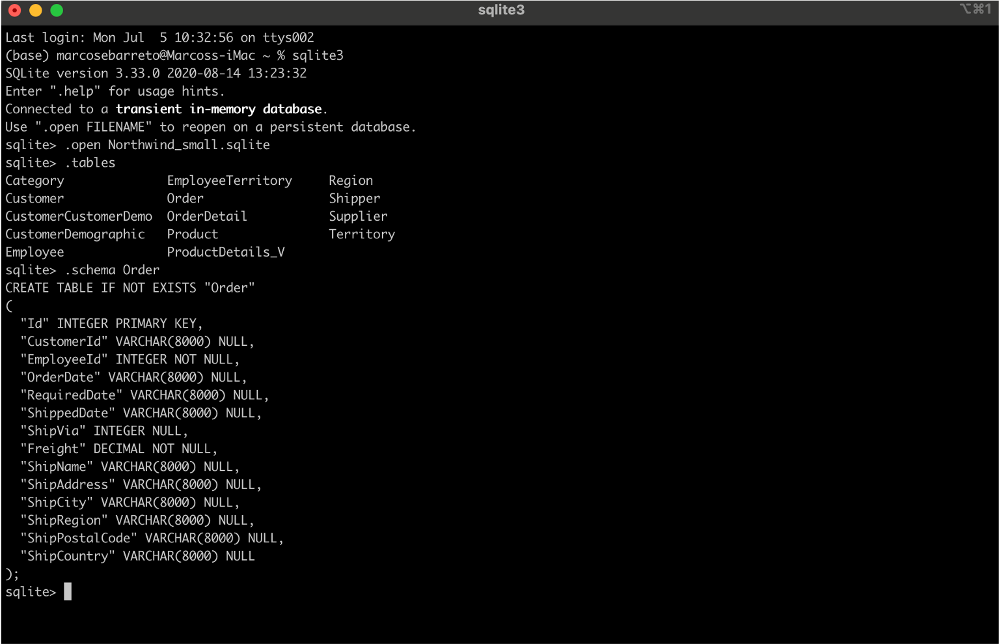
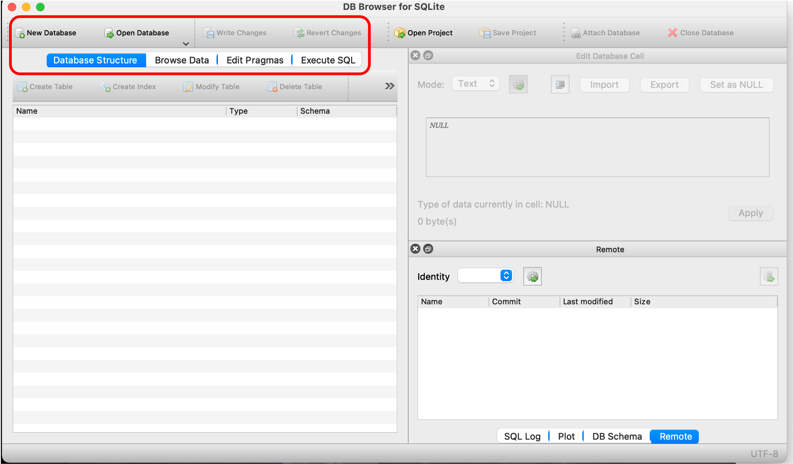
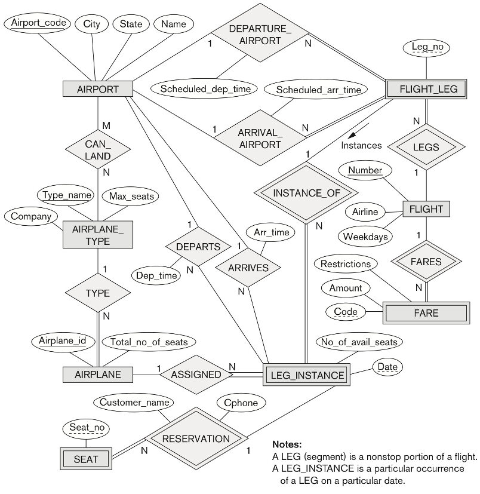

## Semminar 02 - Conceptual data modelling and database design

In this seminar, we will discuss **conceptual modelling**, which is a very important phase in designing database applications. We will:

- concentrate on the database structures and constraints during the conceptual design phase.
- study modelling concepts through the **entity-relationship (ER) model**.
- design conceptual schemas (**ER diagrams**).
- anticipating some SQL concepts and programming.

Recapping from the lecture: the figure below shows an ER diagram for the COMPANY database.



Can you identify:
1. All entities and their types (strong or weak)?
2. All the relationships (including the identifying ones) and their cardinalities?
3. Attributes and their types (key, multivalued, composite, derived)?

**Submit your answer through [Gradescope, Week_02_0_Recap: ER diagram COMPANY](https://www.gradescope.com/courses/278944/assignments/1377326/submissions)**

### Activity 1: data modelling

Consider the UNIVERSITY database depicted below. Build an ER schema for this database showing all entities, attributes, and relationships. Make sure to specify the type of each attribute, cardinalities and any other information as detailed in the figure. Feel free to adapt/change your model if you think necessary.



You can use the Web version of [draw.io](https://app.diagrams.net/) or [download the Desktop version](https://www.diagrams.net/). Any other ER modelling tool can also be used.

**Submit your answer through [Gradescope, Week_02_1: Data modelling UNIVERSITY](https://www.gradescope.com/courses/278944/assignments/1377444/submissions)**

### Activity 2: SQL programming

For this activity, we will use the [Northwind example database](https://github.com/jpwhite3/northwind-SQLite3), adapted for SQLite. This database has been available for SQL Server and Microsoft Access for years. It was provided as a tutorial database for managing small business customers, orders, inventory, purchasing, suppliers, shipping, and employees.


You can open a terminal and type ``sqlite3`` to run the SQLite3 interpreter.

- Download the ``Northwind_small.sqlite`` (from the ``data`` folder) file. There is also a large database in the ``data`` folder.
- Open a terminal (command shell) and type ``sqlite3``.
- Open the file (type ``.open Northwind_small.sqlite``).
- You can view all existing tables in the database by typing ``.tables``.
- You can check any table structure by typing ``.schema <TABLENAME>``.
- You can run SQL commands to query or change (insert, update or delete) the contents of any table (e.g. ``SELECT * FROM Product;``)



Alternatively, you can use the *DB Browser for SQLite3* graphical interface. In this case, please pay attention to the SQL syntax that is generated while you are specifying and/or querying your data model. You can check any table structure in the *Database Structure* tab and also browse the data.



Write SQL commands to answer the following:

1. List all product names and unit prices supplied by each company (supplier). Also list the supplier's name.

<details><summary><b>Solution (Click me)</b></summary>
 
```sql
    SELECT P.ProductName, P.UnitPrice, S.CompanyName
      FROM Product P
      JOIN Supplier S ON P.SupplierId = S.Id
  GROUP BY P.SupplierId
  ORDER BY 2 ASC;
```
  
</details>

2. List the category of the 10 top-seller products.

<details><summary><b>Solution (Click me)</b></summary>
 
```sql
  SELECT CategoryName
    FROM Category C
    JOIN Product P ON C.Id = P.CategoryId
   WHERE P.Id IN
         (SELECT ProductId
            FROM OrderDetail 
        ORDER BY (UnitPrice*Quantity) DESC 
           LIMIT 10);
```
  
</details>

3. List the details of the employee who have placed more orders.

<details><summary><b>Solution (Click me)</b></summary>
 
```sql
  SELECT *
    FROM Employee
   WHERE Id IN
         (SELECT EmployeeId 
            FROM (SELECT EmployeeId, COUNT(*) mycount 
                    FROM [Order] 
                GROUP BY EmployeeId
                ORDER BY 2 DESC)
          LIMIT 1);
```
  
</details>

4.	For all customers, list all the products they bought.


<details><summary><b>Solution (Click me)</b></summary>
 
```sql
    SELECT C.CompanyName, P.ProductName
      FROM Customer C
      JOIN [Order] O ON O.CustomerId = C.Id
      JOIN OrderDetail OD ON OD.OrderId = O.Id
      JOIN Product P ON OD.ProductId = P.Id
  GROUP BY C.Id;
```
  
</details>

**Submit your answer through [Gradescope, Week_02_2: SQL programming NORTHWIND](https://www.gradescope.com/courses/278944/assignments/1377456/submissions)**

### Activity 3: data modelling + SQL programming

For the scenario described below:

1. Build an ER schema showing entities, attributes, cardinalities and relationships (**optional, if you are comfortable with ER diagram design**).

2. Write SQL commands to:

<ul>
  <li>create all entities (tables),</li>
  <li>insert (populate) with some data, and</li>
  <li>answer the following questions:</li>
  <ul>
    <li>list the number of movies for each genre.</li>
    <li>list the name of actors who have done a lead role in the movies.</li>
    <li>list the name of directors who have also acted in a movie.</li>
    <li>list the company details (name and address) of the company that has produced more movies.</li>
  </ul>
 </ul>

You can use the same database tools (SQLite and DB Browser) from Activity 2.

**Submit your answer through [Gradescope, Week_02_3: ER SQL MOVIE](https://www.gradescope.com/courses/278944/assignments/1377503/submissions)**

```
Consider a MOVIE database in which data is recorded about the movie industry. The data requirements are
summarised as follows:

- each movie is identified by a title and year of release. Each movie has a a length in minutes. Each
has a production company and is classified under one or more genres (such as horror, action, drama etc).
Each movie has one or more directors and one or more actors (generic term also including actresses) appear
in it. Each movie also has a plot outline. Finally, each movie has zero or more quotable quotes, each
of which is spoken by a particular actor appearing in the movie.

- actors are identified by name and date of birth and appear in one or more movies. Each actor has a
role in the movie.

- directors are also identified by name and date of birth and direct one or more movies. It is possible
for a director to act in a movie, including that he/she is directing.

- production companies are identified by a name and an address. Each company produces one or more movies.
```

### Homework

A) Consider the AIRPLANE database depicted below. Build an ER schema for this database showing all entities, attributes, and relationships. Make sure to specify the type of each attribute, cardinalities and any other information as detailed in the figure. Feel free to adapt/change your model as necessary.

**Notes:**
- a LEG (segment) is a nonstop portion of a flight.
- a LEG_INSTANCE is a particular ocurrence of a LEG on a particular date.



B) Python + SQL

Open the [datapane_SQLite.ipynb](./datapane_SQLite.ipynb) notebook. It uses the Datapane library to publish interactive dashboards.

Pay special attention to i) how to connect to the database, and ii) how to use SQL commands in Python.

Notice the following:
1. This exercise uses a modified version of the Chinook database (`chinook_m.db`): table names are singular instead of plural (e.g. tracks => track). Also, the table ``invoice_items`` was changed to ``invoice_line``. So, **make sure you download this modified version of the database (from the data folder)**.

2. You will need to i) [install the Datapane library](https://pypi.org/project/datapane/) for Python, ii) register (free) at the [Datapane.com](https://datapane.com/), and iii) take note of your API token (click on your name/photo (top right) and Settings) for connecting to your datapane (from your terminal on your local computer or within your Python code). For connecting through your terminal, type ``datapane login --token=YOUR_TOKEN``. For connecting from your Python code, after importing the Datapane library, run ``!datapane login --token=YOUR_TOKEN``.

Write additional SQL commands for the following questions:

1. Which tracks are on the playlist "Brazilian Music"?

<details><summary><b>Solution (Click me)</b></summary>
 
```sql
  SELECT playlist.name,  track.name
    FROM playlist
    JOIN playlist_track ON playlist_track.playlist_id  = playlist.playlist_id
    JOIN track ON playlist_track.track_id = track.track_id
   WHERE playlist.name = "Brazilian Music";
```
  
</details>

2. How many tracks are there by each of Amy Winehouse's albums? (tip: you can use some aggregation function to count the number of tracks).

<details><summary><b>Solution (Click me)</b></summary>
 
```sql
    SELECT artist.name, album.title, count(*) as number_tracks
      FROM artist
      JOIN album ON artist.artist_id = album.artist_id
      JOIN track ON album.album_id = track.album_id
     WHERE artist.name = "Amy Winehouse"
  GROUP BY title;
```
  
</details>

### References

- [Command Line Shell For SQLite](https://sqlite.org/cli.html)
- All images, except Northwind, from the Elmasri & Navathe reference book. Northwind database image from <a href="https://github.com/jpwhite3/northwind-SQLite3">here</a>.
