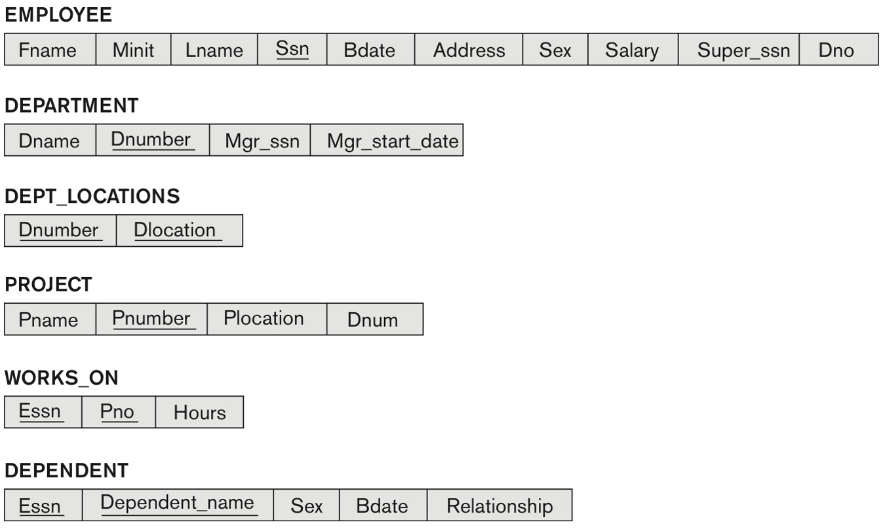
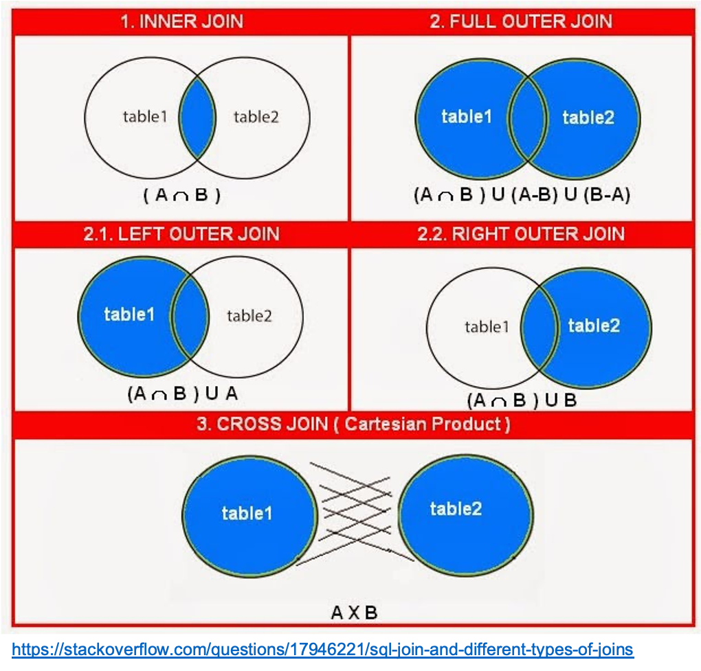

## Seminar 03 - SQL programming (part 1)

In this seminar, we will extend our understanding of the SQL programming language by covering:

- joining tables, grouping data and using subqueries,
- pattern matching, and
- arithmetic operations.

Some basic recap on the structure of a SQL `SELECT` query ("[]" denotes optional):

```
   SELECT  <columns to appear in the output>
     FROM  <table(s) to be used>
    [JOIN  <other tables to be used>]
   [WHERE  <filters applied to rows>]
[GROUP BY  <groups of rows with same column value>]
  [HAVING  <groups filtered according to some condition>]
[ORDER BY  <ordering of results>];
```

### Activity 1: joining tables

We are going to use the `COMPANY` database depicted below to run some example queries involving joining tables, grouping data and subqueries.



1. Download the [Company.db](./data/Company.db) database from the `data` folder into your computer.

2. Load the data into SQLite:

   If you are **using a SQLite session in your terminal**:
   - Connect to the database (type `.open Company.db`).
   - Have a look at all existing tables (type `.tables`).
   - Browse the database structure (type `.schema <TABLE_NAME>` -- eg `.schema department`).

   If you are **using the DB Browser application**:
   - Open the `Company.db` database and have a look at the database structure.

3. Have a look at some SQL example queries for **JOINING TABLES**:



   If you are **using a SQLite session in your terminal**:
   - Load the [joining_tables.sql](./joining_tables.sql) script with examples of different join commands (type `.read joining_tables.sql`).
   - Open this file in any text editor to navigate through the examples.

   If you are **using the DB Browser application**:
   - Go to the `Execute SQL` tab and choose the `Open SQL file` (second buttom from left) option.
   - Load the [joining_tables.sql](./joining_tables.sql) script with examples of different join commands.
   - You can then execute each SQL statement (`Execute current line` button or `Shift+F5`).

### Activity 2: aggregate functions

Still with the [Company.db](./data/Company.db) database, load the [aggregate_functions.sql](./aggregate_functions.sql) script into SQLite (or import it into DB Browser).

We are going to look at some queries using aggregate and specific SQL constructs.

### Activity 3: pattern matching

#### 3.1 - Wildcards

SQLite provides two wildcards for constructing patterns when using the LIKE clause:

- The percent sign `%` wildcard matches any sequence of zero or more characters.
- The underscore `_` wildcard matches any single character.

Similarly, there are wildcards to be used with the GLOB clause:

- The asterisk `*` wildcard matches any number of characters.
- The question mark `?` wildcard matches exactly one character.

Still with the [Company.db](./data/Company.db) database, load the [pattern_matching.sql](./pattern_matching.sql) script into SQLite (or import it into DB Browser).

#### 3.2 - Full-text search module (FTS)

FTS is an SQLite virtual table module that provides full-text search functionality to database applications.

FTS5 is the current version. See the [documentation here](https://www.sqlite.org/fts5.html).

We will replicate an example from this [Medium post](https://medium.com/hackernoon/sqlite-the-unknown-feature-edfa73a6f022).

- Download the [example_FTS5.sql](./example_FTS5.sql) script into your computer.
- Run SQLite in your command terminal (type ``sqlite3``).
- In SQLite, type ``.read example_FTS5.sql`` for running this script.
- You can also open this script in any text editor to see how it works.

### Homework

A) Using the [Company.db](./data/Company.db) database, write SQL commands to answer the following:

- Retrieve the names of all employees in department *5* who earns more than 3000 and work on *ProductZ* project.
- List the names of all employees who are from *Houston, Texas* and work under manager *333445555*.
- Find the names of all employees who are working in the project *Computerization*.

**Submit you answer through [Gradescope Week_03_HWA: SQL COMPANY](https://www.gradescope.com/courses/278944/assignments/1489643/submissions)**

B) Practice with curated Codecademy projects: **pick one** of these projects and try to answer all questions.

- [Trends in Estimated Home Values](https://discuss.codecademy.com/t/data-science-independent-project-4-home-value-trends/419948)
- [Analyzing Airfare Data](https://discuss.codecademy.com/t/data-science-independent-project-5-analyze-airfare-data/419949)

The **datasets** used in these examples can be dowloaded from the links above (alternatively, from the `data` folder).

You will also find guidance on **how to convert CSV data into SQLite datatypes**.

### References

- [SQLite aggregation functions](https://www.sqlitetutorial.net/sqlite-aggregate-functions/) - Tutorial.
- [SQLite built-in aggregate functions](https://sqlite.org/lang_aggfunc.html) - Technical documentation.
- [Arithmetic operators](https://www.tutlane.com/tutorial/sqlite/sqlite-operators)
- [Arithmetic operators](https://www.w3resource.com/sqlite/arithmetic-operators.php)
- [Full text search example](https://www.sqlitetutorial.net/sqlite-full-text-search/)
