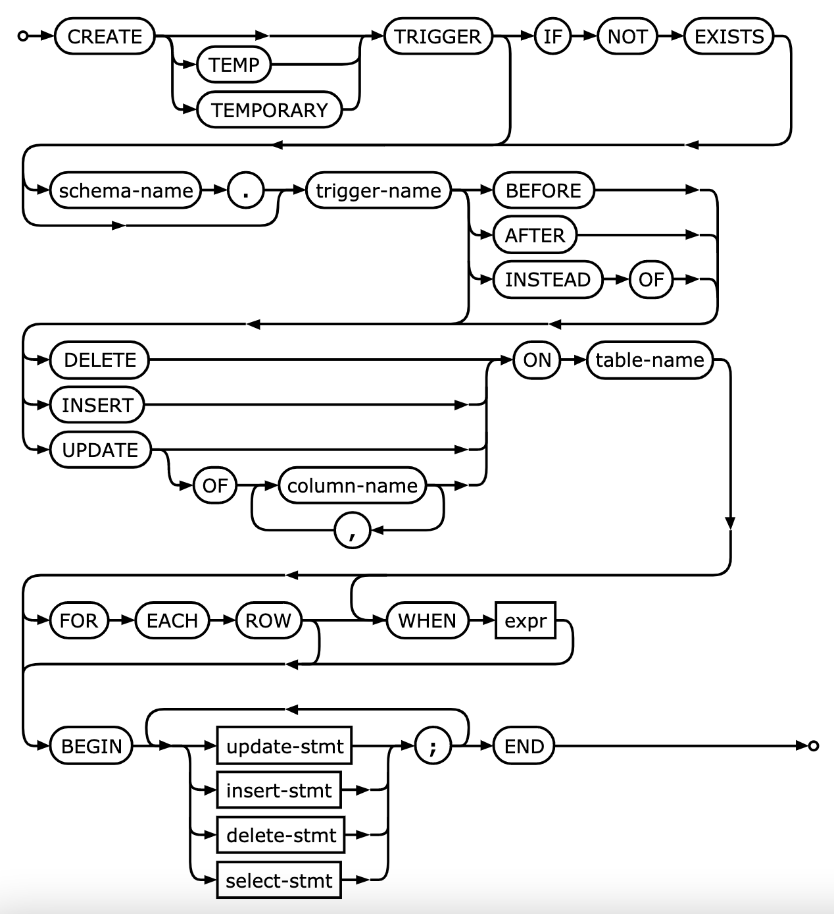
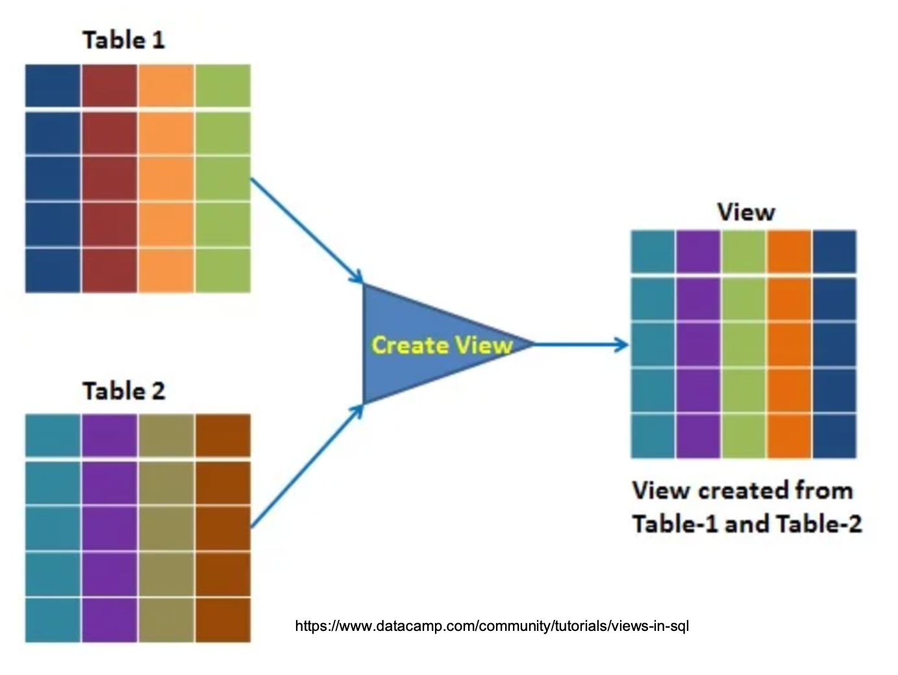

## Seminar 04 - SQL programming (part 2)

In this seminar, we will extend our understanding of the SQL programming language to:

- cover examples of triggers and views,
- recursive queries, and
- how to work with CSV and other data formats.

Remember to check [this week's lecture](https://moodle.lse.ac.uk/course/view.php?id=7681) on **Moodle** for a detailed discussion on DDL (data definition language) and DML (data manipulation language), including how to i) specify integrity constraints and use triggers, and ii) define virtual and materialized views.

### Activity 1 - Triggers

During the database design process, it is useful (and most of the time, necessary) to specify the action to be taken when certain events occur and certain conditions are satisfied. For example, inform an employee whenever her/his travel expenses exceed a certain limit by sending her/him a message. In this case, the condition is used to **monitor** the database.

We can use the command `CREATE TRIGGER` to specify such actions in SQL. Suppose we want to checj whether an employee's salary is greater than the salary of her/sis supervisor in the `COMPANY` database. Several *events* can trigger this rule: inserting a new employee, changing an employee's salary, or changing an employee's supervisor. Suppose that the *action* to take would be to notify the supervisor. We can create a trigger `SALARY_VIOLATION` for that.

<details><summary><b>Trigger SALARY_VIOLATION (Click me)</b></summary>

```sql
  CREATE TRIGGER SALARY_VIOLATION
  BEFORE INSERT OR UPDATE OF Salary, Super_ssn
      ON Employee
     FOR EACH ROW
    WHEN (NEW.Salary > (SELECT Salary
                          FROM Employee
                         WHERE Ssn = NEW.Super_ssn))
          INFORM_SUPERVISOR(NEW.Super_ssn, NEW.Ssn);
```

</details>

A typical trigger is defined as an **ECA (Event, Condition, Action)** rule with three components:

* the **event(s)**: update operations usually applied to the database. When writing a trigger, we must **make sure that all events are accounted for**. We can use the keywords **BEFORE** or **AFTER** to specify whether the trigger should be executed before the triggering operation or after the operation specified in the event is completed.
* the **condition** (`WHEN` clause) determining whether the rule action should be executed. If *no condition* is specified, the action will be executed once the event occurs. If a condition is specified, it is first evaluated and, only *if it evaluates to true* will the rule action be executed.
* the **action** to be taken: usually a sequence of SQL statements, but it can be a database transaction or an external procedure/program (for instance, the `INFORM_SUPERVISOR` routine in our example).

In SQLite, the basic syntax and parameters for triggers are as follows:



- ``trigger name``: unique name for the trigger. Observe that the trigger inherits the schema (atributes) of its table.
- ``BEFORE, AFTER, INSTEAD OF``: specifies whether the function is called before, after or instead of an event.
- ``database-event``:	one of the INSERT, UPDATE, DELETE that will fire the trigger.
- ``table-name``: the name of the table or view the trigger is for.
- ``FOR EACH ROW / STATEMENT``: specifies whether the trigger procedure should be fired once for every row affected by the trigger event, or just once per SQL statement. If neither is specified, FOR EACH STATEMENT is the default.
- ``expr``: a Boolean expression that determines whether the trigger function will actually be executed.
- ``trigger-step``: action for the trigger, it is the SQL statement (INSERT, UPDATE, DELETE, SELECT).

There are two SQLite extensions to triggers: ``OLD`` and ``NEW``.

* Within the trigger body, the ``OLD`` and ``NEW`` keywords enable you to access columns in the rows affected by a trigger.
* In an ``INSERT`` trigger, only ``NEW.col_name`` can be used.
* In a ``UPDATE`` trigger, you can use ``OLD.col_name`` to refer to the columns of a row before it is updated and ``NEW.col_name`` to refer to the columns of the row after it is updated.
* In a ``DELETE`` trigger, only ``OLD.col_name`` can be used; there is no new row.

#### Action items:

Still using the **Company.db** (available in the [data folder](https://github.com/lse-st207/lectures2021_Full/blob/main/Week03/data/Company.db)):
- open the [example_triggers.sql](./example_triggers.sql) script to run different types of triggers.
- **[pair programming activity]**: find an entry point in the script asking you to code a trigger and test it.

### Activity 2 - Views

A **view** is a single table that is derived from other tables. These other tables can be *base tables* or previously
defined views. A view does not necessarily exist physically, being considered a *virtual table* (as opposite to base tables that always exist).



<details><summary><b>What are views used for? (Click me)</b></summary>
<p><br>
They provide a virtual table environment for various complex operations. You can select data from multiple tables, or you can select specific data based on certain criteria in views. You can also specify restrictions to users from accessing sensitive data. They do not hold the actual data; they hold only the definition of the view in the data dictionary.
</p>
</details>

**Types of views**

- ``Simple view``: a view based on only a single table, which does not contain GROUP BY clauses or any functions.
- ``Complex view``: a view based on multiple tables, which contain GROUP BY clause and functions.
- ``Inline view``: a view based on a subquery in FROM clause. That subquery creates a temporary table and simplifies the complex query.
- ``Materialized view``: a view that stores the definition as well as data. It creates replicas (or *snapshots*) of data by storing it physically.

<details><summary><b>What is the consequence of views being virtual tables instead of physical ones? (Click me)</b></summary>
<p><br>
This limits the possible update operations that can be applied over views.
</p>
</details>

<details><summary><b>What are the advantages and disadvantages of materialized views over temporary views? (Click me)</b></summary>
<p><br>
They reduce the processing time to regenerate the whole data. It helps remote users to replicate data locally and improve query performance. The challenging part here is to synchronize the changes in materialized views underlying tables.
</p>
</details>

#### Action items:

Still using the **Company.db** (available in the [data folder](https://github.com/lse-st207/lectures2021_Full/blob/main/Week03/data/Company.db)):
- open the [example_views.sql](./example_views.sql) script to run examples on the use of views.
- **[pair programming activity]**: find an entry point in the script asking you to create two views.

**Notes on implementing and updating views**

The problem of how a DBMS can effectively implement a view for efficient querying is complex. Two main approaches exist:

- **query modification**: involves modifying or transforming the view (submitted by the user) into a query on the underlying base tables. For example, we can have a view named ``WORK_ON1`` defined as follows:

<details><summary><b>(Click me)</b></summary>

```sql
  CREATE TEMP VIEW IF NOT EXISTS WORKS_ON1 AS
  SELECT Fname, Lname, Pname, Hours
    FROM employee, project, works_on
   WHERE Ssn = Essn AND Pno = Pnumber;
```

</details>

A query over this view to select all employees working in the project `ProductX...

<details><summary><b>(Click me)</b></summary>

```sql
  SELECT Fname, Lname
    FROM WORKS_ON1
   WHERE Pname = 'ProductX';
```

</details>

...can be transformed to

<details><summary><b>(Click me)</b></summary>

```sql
  SELECT Fname, Lname
    FROM EMPLOYEE, PROJECT, WORK_ON
   WHERE Ssn = Essn AND Pno = Pnumber AND Pname = 'ProductX';
```

</details>

The disadvantage of this approach is that is is inefficient for views defined via complex queries that are time-consuming to execute, especially if multiple views queries are going to be applied to the same view within a short period of time.

- **materialized view**: involves physically creating a temporary or permanent view table when the view is first queried or created and keeping that table on the assumption that further queries on the view will follow. In this case, we need to design a suitable strategy to keep the view updated based on the contents of the base tables. Some approaches comprise *incremental, immediate, lazy* or *periodic update*.

Views can be queried but issuing an INSERT, DELETE or UPDATE command over them is in many cases not possible. Usually, an update on a *simple view* defined over a single table without any aggregate functions can be mapped to an update on the underlying base table under certain constraints. For a *complex view* involving aggregations and joins, an update operation may be mapped to update operation on the underlying tables in multiple ways, which is not so easy for the DBMS to determine which updates should be performed.

<details><summary><b>Summary on updating views (Click me)</b></summary>
<p><br>
<ul>
<li>A view with a single defining table is updatable if the view attributes contain the primary key of the base table, as well as all attributes with the NOT NULL constraint that do not have default values specified.</li>
<li>Views defined on multiple tables using joins are <b>generally</b> not updatable.</li>
<li>Views defined on multiple tables using grouping and aggregation functions <b>are not</b> updatable.</li>
</ul>
</p>
</details>

### Homework: Pandas and CSV files into SQLite

In this activity, we will create an `University.db` database from 3 files: `courses.csv`, `student.csv`, and `grade.csv`.

This is a simple example of how we can read CSV files into SQLite and manipulate them as Pandas dataframes.

Open the [ex_database_python.ipynb](./ex_database_python.ipynb) to run the code. Remember to download the CSV files from the `data` folder.

### References

- [SQlite trigger documentation](https://www.sqlite.org/lang_createtrigger.html)
- [Wikipedia - Database trigger](https://en.wikipedia.org/wiki/Database_trigger)
- [Wikipedia - views](https://en.wikipedia.org/wiki/View_(SQL)
- [SQLite tutorial on views](https://www.sqlitetutorial.net/sqlite-create-view/)
- [View representation in logical database design](https://dl.acm.org/doi/10.1145/509252.509286) - classical paper from S. Navathe et al. (ACM SIGMOD 1978).
